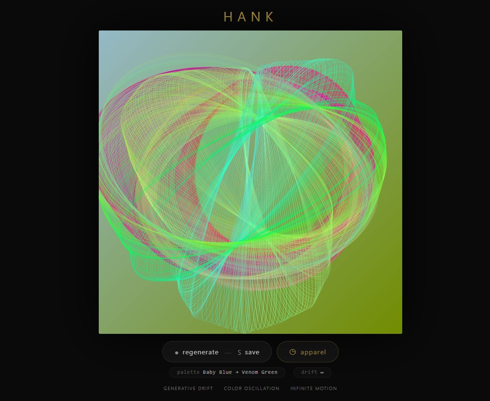
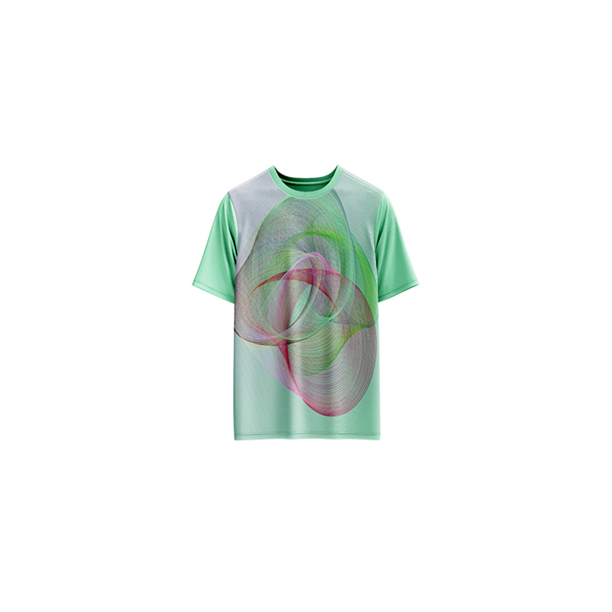

# Hank — Generative Art

[](https://reyrove.github.io/Hank-Generative-Art)
[](https://opensource.org/licenses/MIT)

> **Generative ellipse drift art.** Each refresh creates a unique composition of a drifting ellipse with shifting colors, bouncing across a diagonal gradient background in infinite motion.

## 🎨 Live Demo

<div align="center">
  <a href="https://reyrove.github.io/Hank-Generative-Art" target="_blank">
    
  </a>
  <br><br>
  <a href="https://reyrove.github.io/Hank-Generative-Art" target="_blank">
    
  </a>
  <br>
  <em>Click the image or button to experience the generative art</em>
</div>

## 👕 Apparel Preview

<div align="center">
  
  <br>
  <em>Hank artwork printed on a T-shirt</em>
</div>

## ✨ Features

- **Drifting Ellipse** — A single ellipse continuously moves and bounces
- **Infinite Motion** — Endless animation with smooth transitions
- **Color Oscillation** — RGB values shift randomly for dynamic color changes
- **Gradient Background** — Diagonal gradient with two random colors
- **Rich Color Palettes** — 200+ dark, rich background colors
- **Seed-Based** — Every composition is unique and reproducible via its seed
- **Save & Share** — Download as PNG with seed in filename
- **Apparel Mode** — Preview artwork on a T-shirt mockup
- **Responsive** — Works on desktop, tablet, and mobile
- **Pure JavaScript** — No external dependencies
- **Keyboard Shortcuts**:
  - `R` — Regenerate
  - `S` — Save image
  - `T` — Toggle apparel view

## 🎨 Artwork Details

| Parameter | Range | Description |
|-----------|-------|-------------|
| **Background Colors** | 200+ options | Dark, rich color palette |
| **Ellipse Size** | Variable | Changes and bounces |
| **Ellipse Position** | Variable | Drifts across canvas |
| **Ellipse Color** | RGB | Randomly shifts over time |
| **Rotation** | 0–PI | Rotates at random speed |

## 🎯 How It Works

The artwork features a single ellipse that:

1. **Drifts** — Moves continuously across the canvas
2. **Bounces** — Reflects off walls and boundaries
3. **Changes Size** — Width and height oscillate
4. **Shifts Color** — RGB values drift randomly
5. **Rotates** — Spins at a random speed

All parameters are randomized on each regeneration.

## 🚀 Quick Start

### Local Development

```bash
# Clone the repository
git clone https://github.com/reyrove/Hank-Generative-Art.git

# Navigate to the directory
cd Hank-Generative-Art

# Open in browser
open index.html
# or use a live server
```

### Deploy to GitHub Pages

1. Push to GitHub
2. Go to Settings → Pages
3. Select branch `main` and root folder
4. Your site will be live at `https://reyrove.github.io/Hank-Generative-Art`

## 🧠 How It Works

The artwork is generated using a deterministic random number generator, seeded by timestamp + random noise. Every refresh:

1. **Setup**:
   - Two random background colors for gradient
   - Random ellipse position, size, and rotation
   - Random RGB starting color
   - Random drift and bounce parameters

2. **Animation**:
   - Ellipse moves continuously
   - Bounces off canvas edges
   - Size oscillates within bounds
   - Color shifts randomly over time
   - Rotates at varying speeds

3. **Rendering**:
   - Diagonal gradient background
   - Single stroke ellipse with no fill
   - Smooth, continuous animation

## 📁 File Structure

```
Hank-Generative-Art/
├── index.html          # Main application (all-in-one)
├── Hank.jpg            # T-shirt mockup image
├── fav.svg             # Favicon
├── demo-screenshot.jpg # Website demo screenshot
├── README.md           # This file
└── LICENSE             # MIT License
```

## 🛠️ Tech Stack

- **Pure Vanilla HTML/CSS/JS** — No dependencies
- **Canvas API** — 2D rendering
- **CSS Flexbox/Grid** — Responsive layout
- **GitHub Pages** — Hosting

## 🎯 Interactive Controls

| Action | Keyboard | Button |
|--------|----------|--------|
| Regenerate | `R` | Click "regenerate" |
| Save Image | `S` | Click "regenerate" |
| Toggle Apparel | `T` | Click "apparel" |

## 🎨 The Creative Process

### Infinite Motion
The ellipse never stops moving. It drifts, bounces, and evolves, creating a hypnotic, meditative experience.

### Color Oscillation
RGB values shift randomly over time, creating subtle and sometimes dramatic color changes that keep the artwork feeling alive.

### Gradient Background
Two random colors from a palette of 200+ dark, rich colors create a beautiful diagonal gradient that grounds the drifting ellipse.

### Organic Feel
Despite being a simple ellipse, the combination of drifting motion, size changes, rotation, and color shifts creates an organic, living quality.

## 📱 Responsive Design

The application automatically adapts to:
- Desktop screens
- Tablets
- Mobile phones
- Landscape orientation
- Various aspect ratios

## 🤝 Contributing

Contributions are welcome! Feel free to:
- Fork the repository
- Create a feature branch
- Submit a pull request

### Ideas for Contributions:
- Multiple ellipses
- Different shapes
- Mouse interaction
- Speed controls
- Performance optimizations

## 📄 License

MIT License — see [LICENSE](LICENSE) file for details.

## 🙏 Acknowledgments

- Pure JavaScript implementation
- Inspired by generative drift art
- Special thanks to the creative coding community

---

**Built with ❤️ and infinite drift**